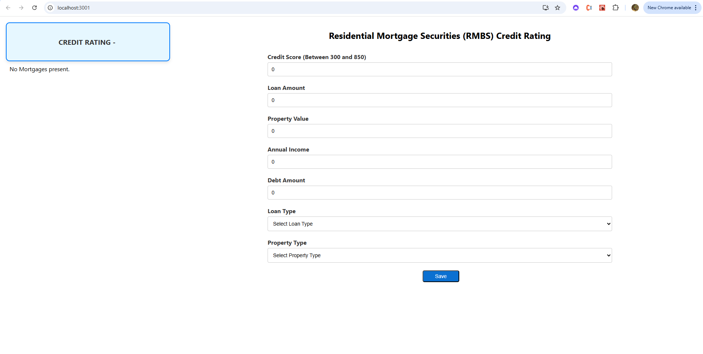
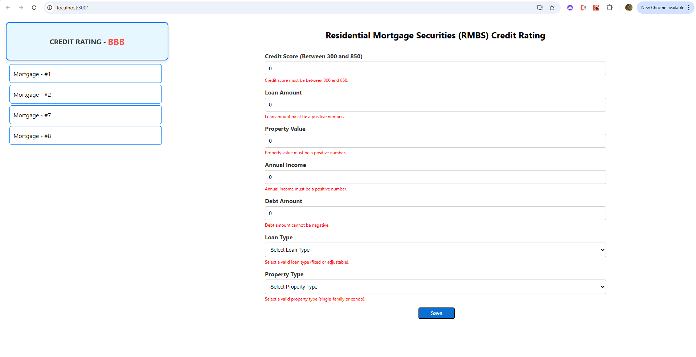
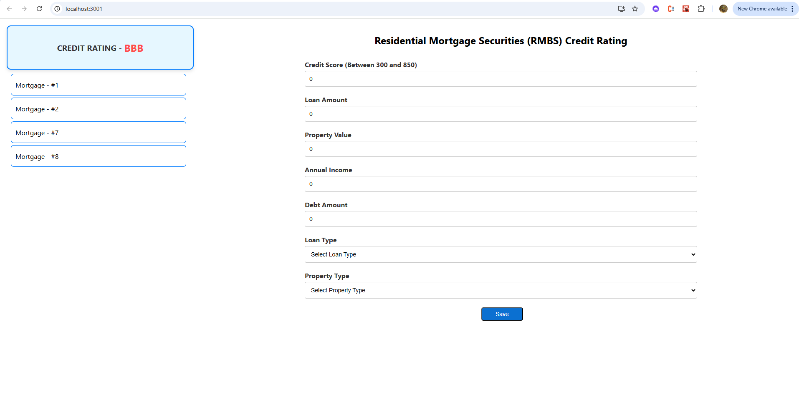
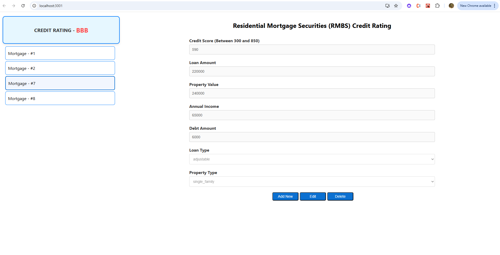

# Credit_Rating

A comprehensive solution for calculating the credit rating of Residential Mortgage-Backed Securities (RMBS). This project includes a frontend for data entry, a backend for credit rating calculations, and a database for storing mortgage data.

**Technology Stack**

Frontend: React, HTML, CSS, JavaScript

Backend: FastAPI (Python)

Database: MySQL

```bash
git clone https://github.com/Jovinafc/Credit_Rating.git
cd Credit_Rating
```

For setting up database schema, make sure that Mysql installed.

```bash
cd database
source schema.sql
```

For Backend setup.

```bash
cd backend
cp .env.example .env
pip install -r requirements.txt
uvicorn app:app --reload
```

API is available at http://127.0.0.1:8000/docs (Swagger UI for API testing).

For Frontend Setup.

```bash
cd frontend
npm i
npm start
```

Open http://localhost:3000 in your browser.

**API Endpoints (Backend)**

POST /mortgages/ - Add a new mortgage

GET /mortgages/ - Retrieve all mortgages

PUT /mortgages/{id} - Update a mortgage

DELETE /mortgages/{id} - Delete a mortgage by ID


**Design Decisions**

- The final credit rating logic is calculated while making the GET API call of getting the list of mortgages.

- When we add/update/delete any mortgage entry after the successful completion of that request action, the get api for getting the list of mortgages is called which then calculate the final credit rating and displays the same with the updated list.

**Screenshots**



Validation of the form.



After Adding some mortgages data.



When we click on any existing mortgage to update.




For questions or contributions, reach out at:

**Contact**

GitHub: JovinAfc

Email: dsouza.jovin65@gmail.com